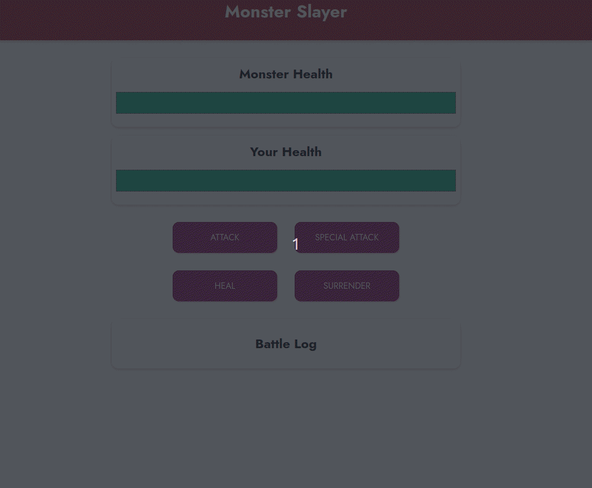

# Vue - The Complete Guide (incl. Router & Composition API)

## Projects
 

- Project 1 : The Monster-slayer game

  

--- 

 

## Topics covered

### Section 1: Intro

- Intro to Vue.
- Rebuilding a simple js app with Vue.

### Section 2: The basics & Core concepts

- Interpolation
- Data binding with v-bind (:)
- Data object & methods
- Events & methods
- Event modifiers
- 2 way binding
- Computed properties
- Watchers
- Dynamic styling using inline & array syntax

### Section 3: Conditional Rendering

- v-if, v-else, v-else-if
- v-show
- v-for
- Removing list items
- Lists & Keys

### Section 4: Vue - Behind the scenes

- Understanding templates
- Refs ($refs)
- Vue app lifecycle

### Section 5: Intro to Components

- Components - Multiple Vue Apps vs Multiple Components